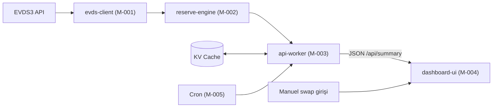
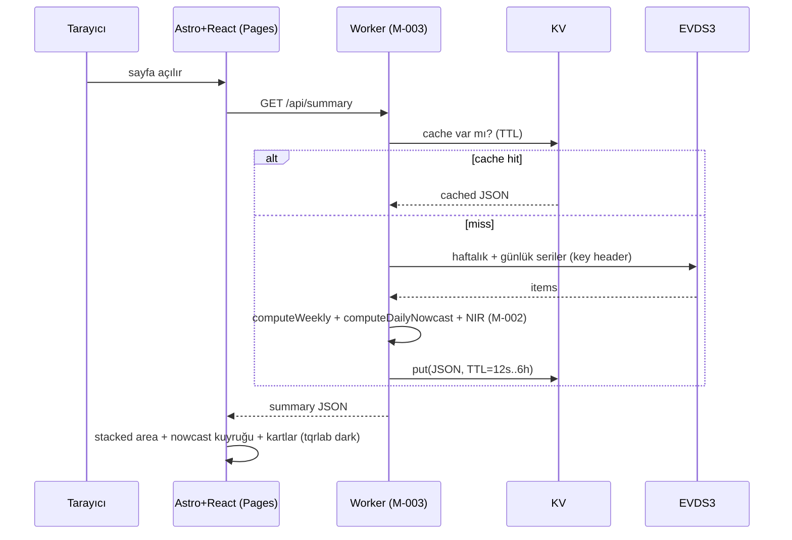

# tqrlab Rezerv Dashboard — Mimari Dokümanı

**Based on:** `tcmb_reserves.py` (v2, doğrulanmış veri katmanı) + bu oturumdaki EVDS3 keşfi
**Date:** 2026-06-22
**Status:** ✅ Validated — 2026-06-22
**Brand:** tqrlab (dark / internal-research varyantı)

---

## 1. Architectural Drivers

| Driver | Bu projede |
|---|---|
| **Scale** | Kişisel + dar paylaşım (tqrlab okuyucu). Multi-user/auth gerekmez. Edge'de statik+light backend yeter. |
| **Change** | En sık değişen: veri (haftalık/günlük) ve UI. EVDS şema/uç **nadiren** değişir ama değişince her şeyi kırar → tek `evds-client` arkasına izole. |
| **Risk** | EVDS anahtarının sızması (client'a asla gitmemeli) ve EVDS3 ucunun yine taşınması. İkisi de tek modülde toplanır. |
| **Performance** | Veri haftalık/günlük tazeleniyor; her ziyarette EVDS'e gitmek gereksiz → KV cache + cron ön-ısıtma. İlk byte hızlı. |
| **Complexity** | En zor kısım nowcast/NIR doğruluğu — ama `tcmb_reserves.py`'de zaten doğrulandı; TS'e **port** edilecek, yeniden tasarlanmayacak. |

**Temel mimari kısıt:** EVDS3 anahtarı HTTP header'ında gidiyor ve CORS yok → tarayıcıdan doğrudan çağrılamaz. Bu yüzden bir **Cloudflare Worker proxy** zorunlu (anahtar Worker secret'ında). Bu, statik `/yz-model-takip` sayfasından farkı: bu sayfa **dinamik** (canlı veri).

---

## 2. Tech Stack

| Layer | Choice | Rationale | Alternatife karşı |
|---|---|---|---|
| Backend (proxy+compute) | **Cloudflare Worker (TypeScript)** | Mevcut altyapın (agent-lab-api deseni); anahtarı secret'ta tutar, CORS'u çözer | Astro SSR endpoint (Pages Functions de olur ama ayrı Worker daha temiz izolasyon) |
| Cache | **Cloudflare KV** | Haftalık/günlük veri; TTL'li cache + cron ön-ısıtma için ideal | D1 (time-series için gereksiz; KV key-value yeterli) |
| Zamanlama | **Cron Trigger** | Günlük analitik bilanço sabah güncellenir; KV'yi ön-ısıt | Client-side polling (gereksiz EVDS yükü) |
| Frontend | **Astro + React islands** | tqrlab.com ile birebir aynı; chart'lar island | Saf React SPA (Astro'nun statik kabuğu daha hızlı + mevcut desen) |
| Chart | **Recharts** | React island, hafif, area+line+composed destekler; tqrlab chart'larınla uyumlu | visx (daha fazla iş), Chart.js (canvas, tema kontrolü daha zor) |
| Styling | **Tailwind + tqrlab tokenları** | Mevcut sistem; CSS değişkenleriyle marka token'ları | Plain CSS (token tekrarına açık) |
| Deploy | **Cloudflare Pages (UI) + Workers (API)** | Mevcut deploy hattın | — |
| Dil/araç | TS, pnpm, wrangler, Astro CLI | Mevcut araç zinciri | — |

**Veri katmanı kaynağı:** Hesaplama mantığı `tcmb_reserves.py`'de doğrulandı (nowcast analist tablosuyla ±0,03). Worker bunu TS'e port edecek — formüller §Veri Katmanı'nda (CLAUDE.md) birebir verili.

---

## 3. Module Decomposition

### Overview

| ID | Modül | Sorumluluk | Karmaşıklık | Agent |
|---|---|---|---|---|
| M-001 | `evds-client` | EVDS3'ten ham seri çek + normalize et (tek dış bağımlılık) | low | sonnet |
| M-002 | `reserve-engine` | Haftalık / günlük-nowcast / NIR / dolarizasyon hesabı (saf fonksiyonlar) | medium | opus |
| M-003 | `api-worker` | HTTP route'ları, KV cache, CORS, hata yönetimi | medium | sonnet |
| M-004 | `dashboard-ui` | Astro sayfa + React island chart'lar + metric kartlar (tqrlab dark) | medium | sonnet |
| M-005 | `scheduled-refresh` | Cron ile KV ön-ısıtma (Faz 4) | low | haiku |

### Details

```json
{
  "modules": [
    {
      "module_id": "M-001",
      "name": "evds-client",
      "responsibility": "EVDS3 web servisinden ham seri çekip {tarih, kod: değer} listesine normalize eder. Anahtar header'da. Tek dış temas noktası.",
      "owns_data": ["raw EVDS series rows"],
      "depends_on": [],
      "external_deps": ["EVDS3 API (evds3.tcmb.gov.tr/igmevdsms-dis/)"],
      "features_served": ["F-001", "F-002", "F-003"],
      "complexity": "low",
      "suggested_agent": "sonnet"
    },
    {
      "module_id": "M-002",
      "name": "reserve-engine",
      "responsibility": "Ham serilerden haftalık brüt rezerv, günlük nowcast, NIR ve dolarizasyon türetir. tcmb_reserves.py mantığının TS portu. Saf, yan etkisiz.",
      "owns_data": ["WeeklyPoint", "DailyPoint", "DolarPoint", "Summary"],
      "depends_on": ["M-001"],
      "external_deps": [],
      "features_served": ["F-001", "F-002", "F-003", "F-004"],
      "complexity": "medium",
      "suggested_agent": "opus"
    },
    {
      "module_id": "M-003",
      "name": "api-worker",
      "responsibility": "Worker fetch handler. /api/summary (+ alt uçlar) sunar, KV cache okur/yazar, CORS ve hata yanıtı verir.",
      "owns_data": ["KV cache entries", "HTTP responses"],
      "depends_on": ["M-001", "M-002"],
      "external_deps": ["Cloudflare KV"],
      "features_served": ["F-005"],
      "complexity": "medium",
      "suggested_agent": "sonnet"
    },
    {
      "module_id": "M-004",
      "name": "dashboard-ui",
      "responsibility": "Astro sayfası + React island'lar: stacked area (haftalık) + günlük nowcast kuyruğu, metric kartlar, NIR ve dolarizasyon panelleri. tqrlab dark tema.",
      "owns_data": ["UI state (yalnızca görsel)"],
      "depends_on": ["M-003"],
      "external_deps": ["Recharts"],
      "features_served": ["F-001", "F-002", "F-003", "F-004", "F-006"],
      "complexity": "medium",
      "suggested_agent": "sonnet"
    },
    {
      "module_id": "M-005",
      "name": "scheduled-refresh",
      "responsibility": "Cron Trigger; günlük/haftalık KV cache'i ön-ısıtır. Faz 4.",
      "owns_data": [],
      "depends_on": ["M-001", "M-002", "M-003"],
      "external_deps": ["Cloudflare Cron Trigger"],
      "features_served": ["F-005"],
      "complexity": "low",
      "suggested_agent": "haiku"
    }
  ]
}
```

### Feature haritası

| F | Özellik |
|---|---|
| F-001 | Haftalık brüt rezerv (toplam/altın/döviz) stacked area + zirve/dip işaretleri |
| F-002 | Günlük brüt rezerv nowcast kuyruğu (en güncel iş günü) |
| F-003 | NIR günlük çizgisi |
| F-004 | Dolarizasyon (haftalık YP mevduat: toplam / yurt içi yerleşik) |
| F-005 | KV cache + zamanlanmış tazeleme (anahtar gizli kalır) |
| F-006 | Metric kartlar (toplam, döviz, altın, NIR, h/h değişim, zirveden %) + manuel swap girişi (seri sonra) |

---

## 4. Interface Contracts

```json
{
  "contracts": [
    {
      "contract_id": "C-001",
      "from": "M-004", "to": "M-003",
      "type": "http_api",
      "interface": {
        "name": "GET /api/summary",
        "query": { "weeklyStart": "string(dd-mm-yyyy, optional)" },
        "output": {
          "weekly":  [ { "tarih": "ISO date", "toplam": "number", "doviz": "number", "altin": "number" } ],
          "daily":   [ { "tarih": "ISO date", "brutRezerv": "number", "nir": "number" } ],
          "dolarizasyon": [ { "tarih": "ISO date", "ypToplam": "number", "ypYurtici": "number" } ],
          "meta": {
            "anchorDate": "ISO date", "anchorBrut": "number",
            "peak": { "tarih": "ISO date", "toplam": "number" },
            "latestWeekly": "ISO date", "latestDaily": "ISO date",
            "updatedAt": "ISO datetime", "unit": "milyar USD", "source": "TCMB EVDS"
          }
        },
        "error_cases": ["evds_unavailable", "evds_auth_failed", "empty_series", "upstream_timeout"]
      }
    },
    {
      "contract_id": "C-002",
      "from": "M-003", "to": "M-002",
      "type": "function_call",
      "interface": {
        "name": "computeWeekly",
        "input": { "rows": "RawRow[] (TP.AB.TOPLAM, TP.AB.C2, TP.AB.C1)" },
        "output": { "weekly": "WeeklyPoint[] (mlr USD, değerler /1000)" },
        "error_cases": ["empty_series"]
      }
    },
    {
      "contract_id": "C-003",
      "from": "M-003", "to": "M-002",
      "type": "function_call",
      "interface": {
        "name": "computeDailyNowcast",
        "input": {
          "weekly": "WeeklyPoint[]",
          "dailyRows": "RawRow[] (TP.AB.A02, TP.AB.A10, TP.DK.USD.A.YTL)"
        },
        "output": { "daily": "DailyPoint[] (brutRezerv, nir)" },
        "error_cases": ["no_anchor", "anchor_not_in_daily"]
      }
    },
    {
      "contract_id": "C-004",
      "from": "M-002", "to": "M-001",
      "type": "function_call",
      "interface": {
        "name": "fetchSeries",
        "input": { "codes": "string[]", "start": "dd-mm-yyyy", "end": "dd-mm-yyyy" },
        "output": { "rows": "RawRow[] ({tarih, [code]: number|null})" },
        "error_cases": ["evds_unavailable", "evds_auth_failed", "non_json_response"]
      }
    }
  ]
}
```

**Contract kuralları:** Tüm alanlar tipli (no `any`). Her contract hata vakalarını tanımlar. En basit iletişim tipi: UI↔Worker HTTP, Worker içi function call. `evds-client` dışında hiçbir modül EVDS'e dokunmaz.

---

## 5. Data Flow



---

## 6. Key Sequences



---

## 7. Build Order (thin-slice)

```json
{
  "build_phases": [
    {
      "phase": 1,
      "name": "Foundation — dikey dilim",
      "modules": ["M-001 (yalnız haftalık)", "M-002 (yalnız computeWeekly)", "M-003 (/api/weekly + KV)", "M-004 (tek chart: haftalık stacked area)"],
      "rationale": "Uçtan uca çalışan en küçük dilim: EVDS → Worker → KV → Astro/React → ekranda grafik. Deploy edilebilir.",
      "deliverable": "Canlı EVDS verisiyle haftalık rezerv grafiği tqrlab temasında yayında",
      "estimated_effort": "medium"
    },
    {
      "phase": 2,
      "name": "Günlük nowcast + metric kartlar",
      "modules": ["M-001 (+günlük A02/A10/USD)", "M-002 (+nowcast +NIR)", "M-003 (/api/summary)", "M-004 (nowcast kuyruğu + kartlar)"],
      "rationale": "Recency'yi analist tablosuyla eşitler; headline metrikler görünür.",
      "deliverable": "Günlük nowcast kuyruğu + toplam/döviz/altın/NIR/h-h/zirveden% kartları",
      "estimated_effort": "medium"
    },
    {
      "phase": 3,
      "name": "Dolarizasyon + swap slotu",
      "modules": ["M-001/M-002 (dolarizasyon)", "M-003 (/api/dolarizasyon)", "M-004 (panel + manuel swap girişi → NIR−swap kartı, uyarı notu)"],
      "rationale": "Tabloyu tamamlar; swap serisi gelene kadar manuel giriş slotu hazır.",
      "deliverable": "Dolarizasyon paneli + swap-hariç net kartı (caveat'lı)",
      "estimated_effort": "small"
    },
    {
      "phase": 4,
      "name": "Sertleştirme",
      "modules": ["M-005 (cron ön-ısıtma)", "M-004 (loading/error/mobil)", "opsiyonel: light-tema PDF/paylaşım varyantı"],
      "rationale": "Performans + dayanıklılık + dış paylaşım.",
      "deliverable": "Cron-warmed cache, hata/yükleme durumları, mobil uyum",
      "estimated_effort": "small"
    }
  ]
}
```

**Thin-slice kuralı:** Her faz tek başına deploy edilebilir ve bir sonrakine geçmeden gözden geçirilir. Faz 1 bitmeden Faz 2 kodu yazılmaz (BDUF'tan kaçın).

---

## 8. Decisions & Trade-offs

- **Ayrı Worker vs Pages Functions:** Ayrı Worker seçildi — anahtar izolasyonu net, agent-lab-api desenini tekrarlıyor, UI deploy'undan bağımsız. Pages Functions de mümkündü; reddedildi çünkü API/UI yaşam döngüsünü ayrı tutmak istiyoruz.
- **KV vs D1:** KV. Veri küçük ve key-value; D1'in time-series desteği bu iş için gereksiz. (Tarihsel seri zaten EVDS'de; biz cache'liyoruz.)
- **Nowcast'i Worker'da hesapla (UI'da değil):** Tek doğruluk noktası, cache'lenebilir, client hafif. Formül `tcmb_reserves.py`'den port.
- **Recharts:** React island ekosistemiyle uyumlu, tema kontrolü kolay. visx daha fazla iş, Chart.js canvas tema kontrolü zor.
- **Swap serisi ertelendi:** UI'da manuel giriş slotu; NIR−swap caveat'lı gösterilecek (kaynaklar arası tanım farkı nedeniyle birebir analist rakamı garanti değil).

## 9. Çözülen Kararlar (kilitli — 2026-06-22)

1. **Entegrasyon:** Dashboard mevcut **tqrlab.com Astro repo'suna yeni route** olarak eklenir: `/tcmb-rezerv-takip` (`/yz-model-takip` deseni). Standalone repo değil.
2. **Worker:** **Yeni `tcmb-rezerv-api` Worker'ı.** `agent-lab-api` genişletilmez — temiz sınır.
3. **Cache TTL:** Haftalık ~6 saat; günlük iş saatlerinde ~1 saat. Cron, TCMB analitik bilanço yayım saatine ayarlanır (KV ön-ısıtma, Faz 4).
4. **Erişim:** Sayfa **public** (Cloudflare Access gating yok).
